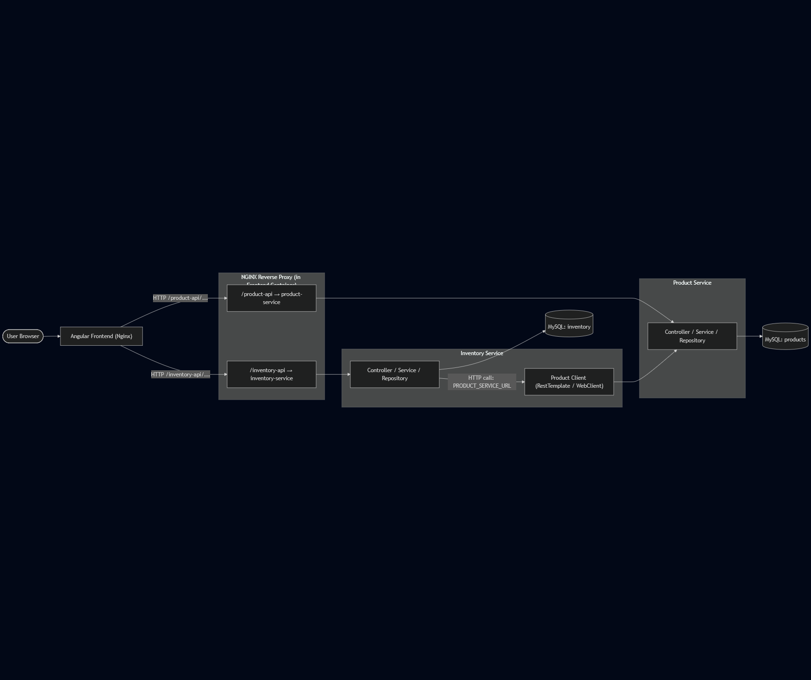

# Inventory LinkTIC

This guide provides instructions for building, running, and managing a Dockerized application using the provided Dockerfile and its commands.

## Backend Structure

- Inventory Service

```
─inventory-app
│   ├───.idea
│   ├───.mvn
│   ├───inventory-commons
│   │   ├───src
│   │   │   ├───main
│   │   │   │   └───java
│   │   │   │       ├───api
│   │   │   │       ├───dto
│   │   │   │       └───exception
│   │   │   └───test
│   │   │       └───java
│   └───inventory-service
│       ├───.mvn
│       │   └───wrapper
│       ├───src
│       │   ├───main
│       │   │   ├───java
│       │   │   │   └───com
│       │   │   │       └───felipezea
│       │   │   │           └───inventory
│       │   │   │               ├───client
│       │   │   │               │   └───handler
│       │   │   │               ├───configuration
│       │   │   │               ├───controller
│       │   │   │               ├───entity
│       │   │   │               ├───handler
│       │   │   │               ├───repository
│       │   │   │               ├───security
│       │   │   │               └───service
│       │   │   └───resources
│       │   │       ├───static
│       │   │       └───templates
│       │   └───test
│       │       └───java
│       │           └───com
│       │               └───felipezea
│       │                   └───inventory
```
- Product Service

```
├───product-commons
│   ├───src
│   │   ├───main
│   │   │   └───java
│   │   │       └───com
│   │   │           └───felipezea    
│   │   │               ├───api      
│   │   │               ├───dto      
│   │   │               └───exception
│   │   └───test
│   │       └───java
└───product-service
    ├───.mvn
    │   └───wrapper
    ├───src
    │   ├───main
    │   │   ├───java
    │   │   │   └───com
    │   │   │       └───felipezea
    │   │   │           └───product
    │   │   │               ├───configuration
    │   │   │               ├───controller
    │   │   │               ├───entity
    │   │   │               ├───handler
    │   │   │               ├───repository
    │   │   │               ├───security
    │   │   │               └───service
    │   │   └───resources
    │   │       ├───static
    │   │       └───templates
    │   └───test
    │       └───java
    │           └───com
    │               └───felipezea
    │                   └───product

```

- Frontend

```
├───public
└───src
    ├───app
    │   ├───interceptor
    │   ├───interface
    │   ├───inventory
    │   │   ├───inventory-center
    │   │   ├───inventory-create
    │   │   ├───inventory-form
    │   │   └───purchase-create
    │   ├───products
    │   │   ├───product-center
    │   │   ├───product-create
    │   │   ├───product-form
    │   │   ├───product-list
    │   │   └───product-update
    │   ├───routes
    │   └───services
    └───environments
```

## Before the Docker Image

- Spring boot Projects

In the root of the microservices run the next command to compile
the projects and generate the JARs:

`mvn clean install -DskipTests`

- Angular Frontend

- `ng build`

## Building the Container with docker compose

In the root folder run the next commands:

1. `docker compose build`
2. `docker compose up -d`

This will build the containers and make them available through the next URL:
- Backend
  1. Inventory Service: http://localhost:8082/swagger-ui/index.html
  2. Product Service:  http://localhost:8081/swagger-ui/index.html
- Frontend
  1. http://localhost:4200/products

## Backend Endpoints

- Product
  1. http://localhost:8081/api/products/{id} -> Find by ID
  2. http://localhost:8081/api/products/{id} -> Update
  3. http://localhost:8081/api/products/ -> Create
  4. http://localhost:8081/api/products/ -> Find All (Pagination)
  5. http://localhost:8081/api/products/{id} -> Delete By id

- Inventory
    1. http://localhost:8082/api/products/{id} -> Find by ID
    2. http://localhost:8082/api/inventory/update -> Update
    3. http://localhost:8082/api/inventory/ -> Create
    4. http://localhost:8082/api/inventory/purchase -> Make a Purchase
    

## Diagram

